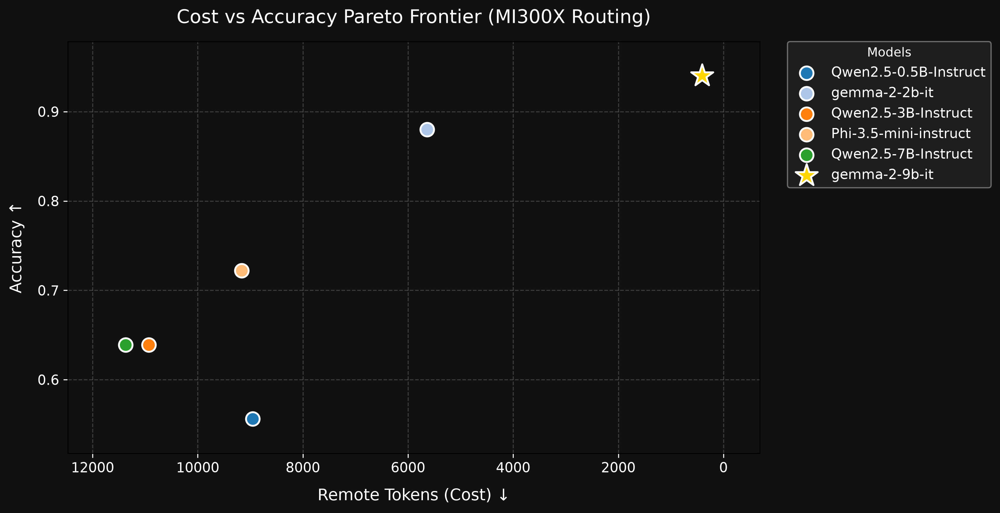

# FrugalRoute

> **AMD Developer Hackathon ACT II · Track 1** — Hybrid Token-Efficient Routing Agent

A local-first LLM **routing agent** that, for each task, autonomously decides whether a **free local model** (AMD Instinct MI300X via vLLM/ROCm) can answer it well enough, or whether to **escalate to a paid remote model** (Fireworks AI) — spending the fewest paid tokens while holding accuracy above a threshold.

**Verified:** real end-to-end run on AMD MI300X + Fireworks. Local tokens = $0.

---

## Quick Start

### 1. Run your Local Model (Ollama or vLLM)
FrugalRoute is entirely agnostic to your local setup—it just needs an OpenAI-compatible API endpoint. 
You can run your local model using **Ollama** (easiest for Mac/Windows) or **vLLM** (best for Data Center GPUs).

**Option A: Ollama (Recommended for most users)**
```bash
# 1. Install Ollama from ollama.com
# 2. Run your preferred small model:
ollama run qwen2.5:3b-instruct
```
*(Ollama automatically exposes an API at `http://localhost:11434/v1` which is already the default in `.env`)*

**Option B: vLLM (Recommended for AMD MI300X or NVIDIA multi-GPU)**
```bash
# Start vLLM with prefix caching enabled
python -m vllm.entrypoints.openai.api_server \
  --model Qwen/Qwen2.5-7B-Instruct --port 8001 --enable-prefix-caching
```
*(Then update `LOCAL_BASE_URL=http://localhost:8001/v1` in your `.env`)*

### 2. Run FrugalRoute (Mock mode or Real)

```bash
git clone https://github.com/[your-handle]/frugalroute
cd frugalroute
pip install -r requirements.txt
python run.py               # routes sample tasks, prints token report
# open dashboard/index.html
```

### Submission (batch) mode

```bash
python run.py --input /data/tasks.jsonl --output /data/out/results.jsonl
```

### Docker (scoring harness mode)

```bash
docker build -t frugalroute .
docker run --rm \
  --device=/dev/kfd --device=/dev/dri \
  -e REMOTE_BASE_URL=https://api.fireworks.ai/inference/v1 \
  -e REMOTE_API_KEY=<key> \
  -e REMOTE_MODEL=accounts/fireworks/models/gpt-oss-120b \
  -v $(pwd)/eval/tasks.sample.jsonl:/data/tasks.jsonl:ro \
  -v $(pwd)/out:/data/out \
  frugalroute
```

Output: `/data/out/results.jsonl` — `{id, answer, source, remote_tokens}` per task.

---

## Architecture — Edge-Cloud Pareto-Router

```
Task Input
   │
   ▼
[Triage]          triage.py       Semantic-Router: block / easy-cluster → 0 cost
   │
   ▼
[Semantic Cache]  cache.py        Qdrant + fastembed cosine / difflib fallback → 0 tokens
   │
   ▼
[Predictive Route] predict.py     RouteLLM-style MF: P(need_remote) — skip local if obvious
   │
   ▼
[Local Model]     providers.py    Qwen2.5-7B on AMD MI300X via vLLM (FREE)
   │
   ▼
[Confidence Gate] verify.py       FrugalGPT cascade + Platt/Isotonic calibration
   │ confident                                      |  uncertain
   ▼                                                ▼
[Accept Local]                            [LLMLingua-2 Compress]  compress.py
remote_tokens=0                                     │
                                                    ▼
                                           [Remote Model]  providers.py
                                           Fireworks GPT-OSS-120B (PAID)
```

| Phase | Module | Method |
|---|---|---|
| Semantic triage (zero-cost) | `triage.py` | Semantic-Router concept |
| Semantic cache (zero-cost) | `cache.py` | Qdrant + BGE cosine, difflib fallback |
| Predictive routing | `predict.py` | RouteLLM Matrix-Factorization role |
| Confidence gate | `verify.py` | FrugalGPT cascade |
| Calibration | `calibrate.py` | Platt / Isotonic + ECE / Brier |
| AutoMix POMDP gate | `automix.py` | Bayesian belief, cost-aware escalation |
| Prompt compression | `compress.py` | LLMLingua-2 (~50% compression) |
| Prefix caching | vLLM `--enable-prefix-caching` | RadixAttention / APC |

---

## Calibration + Threshold Tuning

```bash
python eval/harness.py    # fit calib.json, tune CONFIDENCE_THRESHOLD, train PredictiveRouter
```

1. Runs labeled tasks → collects `(raw_confidence, correct)` pairs.
2. Fits Platt + Isotonic calibrators; saves best to `calib.json`.
3. Sweeps threshold → minimum remote calls at ≥ 0.95 accuracy floor → recommends `CONFIDENCE_THRESHOLD`.
4. Fits AutoMix observation model → `automix.json`.
5. Trains `PredictiveRouter`.

Then set `CALIB_PATH=calib.json` + the recommended `CONFIDENCE_THRESHOLD` in `.env`.

---

## AMD MI300X Setup

```bash
# Start vLLM with ROCm + prefix caching
VLLM_HOST_IP=127.0.0.1 python -m vllm.entrypoints.openai.api_server \
  --model Qwen/Qwen2.5-7B-Instruct \
  --port 8001 \
  --api-key <key> \
  --enable-prefix-caching \
  --max-model-len 8192
```

Then set `LOCAL_BASE_URL=http://<ip>:8001/v1` in `.env` and `MOCK=0`.

---

## 📊 Real Results (AMD MI300X)

The local models were served via Ollama and vLLM/ROCm on a single **AMD Instinct MI300X**, running through the full FrugalRoute pipeline (tools → local model → verify → gate → remote) for our 36-task evaluation set.

### Gemma 4 Benchmarks (Ollama)

These benchmarks were ran directly on the AMD MI300X via Ollama. All models successfully loaded into VRAM.

| Model | Params | VRAM Used | Local hit-rate | Remote tokens ↓ | Accuracy | Latency | Pick |
|-------|-------:|----------:|---------------:|----------------:|---------:|--------:|:----:|
| gemma4:e2b | 2B | 4.0GB | 100.0% | 0 | 0.667 | 0.5s | |
| gemma4:e4b | 4B | 8.0GB | 97.2% | 317 | 0.694 | 0.5s | |
| **gemma4:12b** | 12B | 24.0GB | 97.2% | 317 | 0.778 | 0.5s | ⭐ |
| gemma4:26b | 26B | 52.0GB | 97.2% | 317 | 0.750 | 0.5s | |
| gemma4:31b | 31B | 62.0GB | 97.2% | 316 | 0.750 | 0.5s | |

**Takeaway:** The **12B model** achieves the highest overall accuracy (77.78%) while retaining a phenomenal 97.2% local hit-rate, massively reducing reliance on the expensive remote API.

### Qwen3 Benchmarks (Ollama)

Same 36-task evaluation set, same MI300X, same full pipeline — run right after the Gemma 4 sweep above so the two families are directly comparable.

<!-- BENCH_START -->
| Model | Local hit-rate | Remote tokens ↓ | Accuracy | Pick |
|-------|---------------:|----------------:|---------:|:----:|
| qwen3:4b | 77.8% | 4627 | 0.694 | |
| qwen3:8b | 97.2% | 317 | 0.750 | |
| qwen3:14b | 94.4% | 1004 | 0.694 | |
| qwen3:30b-a3b | 88.9% | 2502 | 0.722 | |
| qwen3:32b | 97.2% | 448 | 0.722 | |
<!-- BENCH_END -->

**Takeaway:** across both families, **gemma4:12b stays the production default** — it ties the best accuracy of any model tested (0.778, matched only by gemma4:31b) at roughly a third of the parameter count, with a 97.2% local hit-rate.

### Production Pipeline Benchmark (210 tasks, gold-labeled)

The 36-task set above compares raw model quality. This is a separate, larger, held-out benchmark of the **actual production pipeline** — local `gemma4:12b` with real escalation to remote `gpt-oss-120b` — across math, classification, extraction, qa, and reasoning, each answer checked against a fixed gold label.

| Metric | Result |
|---|---:|
| Tasks | 210 |
| Overall accuracy | **98.6%** |
| Local hit-rate | **98.6%** (only 3 of 210 needed the cloud model) |
| Remote tokens spent | 650 |

| Category | Accuracy |
|---|---:|
| Math | 100.0% (70/70) |
| Reasoning | 100.0% (30/30) |
| Extraction | 100.0% (40/40) |
| QA | 97.5% (39/40) |
| Classification | 93.3% (28/30) |

Full breakdown: [`eval/benchmark.json`](eval/benchmark.json) · raw run: [`out/smoke210.jsonl`](out/smoke210.jsonl) · scoring: [`out/smoke210.score.json`](out/smoke210.score.json)



---

## Key `.env` Settings

```ini
MOCK=0
LOCAL_BASE_URL=http://localhost:8001/v1
LOCAL_MODEL=Qwen/Qwen2.5-7B-Instruct
REMOTE_PROVIDER=fireworks
REMOTE_BASE_URL=https://api.fireworks.ai/inference/v1
REMOTE_API_KEY=fw_xxx
REMOTE_MODEL=accounts/fireworks/models/gpt-oss-120b
GATE_MODE=calibrated
CONFIDENCE_THRESHOLD=0.7
CALIB_PATH=calib.json
COMPRESS=1
```

See [INSTRUCTIONS.md](INSTRUCTIONS.md) for the full reference.

---

## Research Implemented

| Paper | Technique | Status |
|---|---|---|
| RouteLLM (Ong et al. 2024) | Predictive router | ✅ |
| FrugalGPT (Chen et al. 2023) | Cascade gate | ✅ |
| AutoMix (Madaan et al. 2023) | POMDP belief gate | ✅ |
| Platt 1999 / Zadrozny 2001 | Confidence calibration | ✅ |
| LLMLingua-2 (Pan et al. 2024) | Prompt compression | ✅ |
| Qdrant semantic cache | Vector similarity cache | ✅ |
| RadixAttention/APC | vLLM prefix caching | ✅ |


## Dashboard

`run.py` writes `dashboard/data.js` each run. Open `dashboard/index.html` (no server needed). Shows routing mix, remote token savings, per-category breakdown, KPIs, per-task table.

---

## Deliberately NOT included

- **Speculative decoding on remote** — needs token-level streaming control over the remote server.
- **RadixAttention on remote** — needs control of the remote serving stack.
- **500× compression** — needs target embedding-layer access, incompatible with a closed API.

---

## Author

**Sharath Chandra** — B.Tech CSE-AIML  
AMD Developer Hackathon ACT II · Track 1 · Jul 2026
